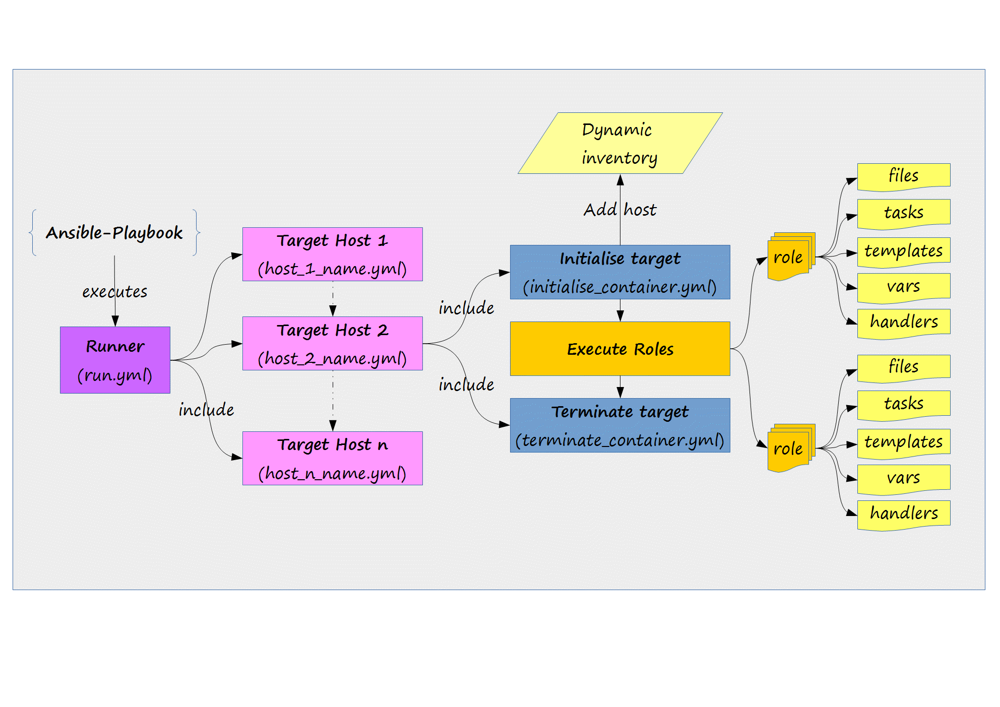

# Ansible Seed

This seed  provides a way to speed up the process of developing Ansible playbooks using Docker containers as hosts.
As a by product, it can also be used to create Docker images using Ansible to perform complex provisioning actions.
These actions could, for example, entail the installation of a middleware software, start it up and executing application specific configuration against its API.
If the final hosts for the playbooks are Virtual Machines or physical hosts, then multiple services can be required to run on the hosts. 
In this case, to test the installation of the services in the hosts, a special Docker based image whith systemd can be used to develop the plays.

# Requirements
- Linux environment running Docker (1.6+)
- Ansible 2.+: the Docker connection plugin is used to avoid having to install SSH in the containers.
- docker-py 1.2.3

# Execution Process

The following image shows the execution process:

For each host:

1. Create container using the selected Docker base image (this could normally be an image containing the required Standard Operating Environment)
2. Switch the host to the created container and execute one or more roles on the container.
3. Stop the container
4. Commit the container to a new image
5. Delete the container

The new image can be used to create containers to inspect the state of the installation by runing the bash shell within the container.

# Development Project Structure

The following image shows the project structure when developing and testing playbooks against Docker containers:

# Provisioning Project Structure

The following image shows the project structure when executing the playbook against Virtual Machines using the SSH connection plugin:

